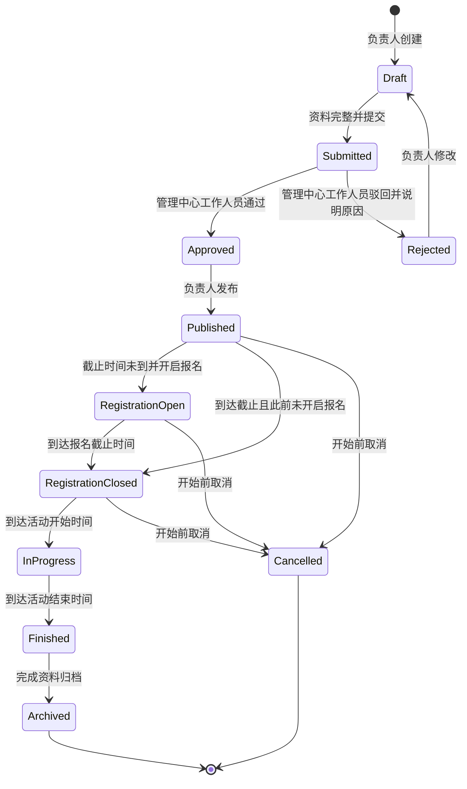
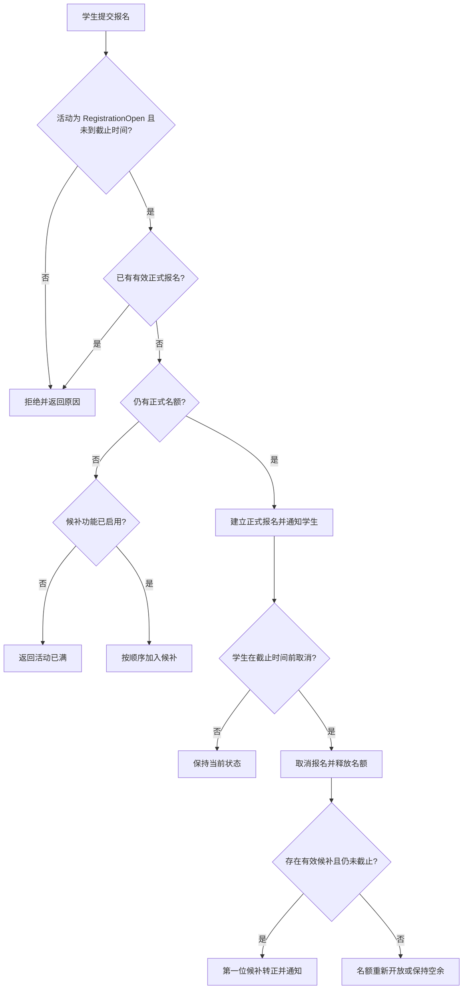

# 核心业务流程

## 活动生命周期

```mermaid
stateDiagram-v2
    [*] --> Draft: 负责人创建
    Draft --> Submitted: 资料完整并提交
    Submitted --> Approved: 管理中心工作人员通过
    Submitted --> Rejected: 管理中心工作人员驳回并说明原因
    Rejected --> Draft: 负责人修改
    Approved --> Published: 负责人发布
    Published --> RegistrationOpen: 截止时间未到并开启报名
    Published --> RegistrationClosed: 到达截止且此前未开启报名
    RegistrationOpen --> RegistrationClosed: 到达报名截止时间
    RegistrationClosed --> InProgress: 到达活动开始时间
    InProgress --> Finished: 到达活动结束时间
    Finished --> Archived: 完成资料归档
    Published --> Cancelled: 开始前取消
    RegistrationOpen --> Cancelled: 开始前取消
    RegistrationClosed --> Cancelled: 开始前取消
    Archived --> [*]
    Cancelled --> [*]
```

Published 只表示活动公开可见。只有 RegistrationOpen 且当前时间早于报名截止时间时，学生才可正式报名；到达截止时刻即停止报名（BR-001、BR-006、BR-007）。

## 报名、候补与取消

```mermaid
flowchart TD
    A[学生提交报名] --> B{活动为 RegistrationOpen 且未到截止时间?}
    B -- 否 --> X[拒绝并返回原因]
    B -- 是 --> C{已有有效正式报名?}
    C -- 是 --> X
    C -- 否 --> D{仍有正式名额?}
    D -- 是 --> E[建立正式报名并通知学生]
    D -- 否 --> F{候补功能已启用?}
    F -- 否 --> G[返回活动已满]
    F -- 是 --> H[按顺序加入候补]
    E --> I{学生在截止时间前取消?}
    I -- 否 --> J[保持当前状态]
    I -- 是 --> K[取消报名并释放名额]
    K --> L{存在有效候补且仍未截止?}
    L -- 是 --> M[第一位候补转正并通知]
    L -- 否 --> N[名额重新开放或保持空余]
```

活动取消后停止报名、候补转正和签到，并向已有正式报名者及有效候补者发送站内通知。
