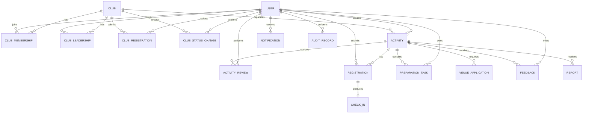

# 概念领域数据模型

本模型只描述需求阶段的业务概念和关系，不规定数据库表、字段、字段类型、索引或存储方案。本次范围澄清仅补充社团备案、业务状态和负责人关系。

## 简要数据字典

| 实体 | 含义 | 关键约束 |
|---|---|---|
| USER | 系统账号及平台角色 | 密码不在本模型中以明文属性表示；访问受 NFR-004、NFR-005 约束 |
| CLUB / CLUB_MEMBERSHIP | 社团、社团业务状态及用户在社团中的成员关系 | 社团状态包括正常、停用等经确认的业务状态；同时依据角色和资源归属授权（BR-009、FR-034） |
| CLUB_LEADERSHIP | 学生用户担任某个学生社团负责人的关系及其变更记录 | 负责人变更须记录原负责人、新负责人、确认人和时间，并由管理中心工作人员确认（FR-034） |
| CLUB_REGISTRATION | 学生社团提交的备案信息及管理中心审核结果 | 通过后备案生效；驳回必须记录原因（FR-033） |
| CLUB_STATUS_CHANGE | 社团正常、停用等业务状态的治理记录 | 仅有相应职责的管理中心工作人员可确认，变更结果应可追踪（FR-034） |
| ACTIVITY | 活动基本信息与生命周期状态 | 时间顺序合法；状态按 BR-006、BR-007 变化 |
| ACTIVITY_REVIEW | 学校社团管理中心工作人员对活动的审核结论 | 驳回必须有原因（BR-011） |
| REGISTRATION | 正式报名、候补或取消记录 | 正式报名不超过容量；同用户同活动最多一条有效正式报名（BR-002） |
| CHECK_IN | 正式报名者的签到记录 | 每名学生每个活动最多一条有效签到（BR-010） |
| PREPARATION_TASK | 活动筹备任务 | 至少包含标题、负责人、状态、期限和所属活动（BR-008） |
| VENUE_APPLICATION | 场地及使用时段申请 | 已批准时段不得冲突（BR-012） |
| NOTIFICATION | 关键业务事件的站内通知 | 同一事件重试不产生重复通知（FR-020） |
| FEEDBACK / REPORT | 活动评价与活动举报 | 评价限已签到学生；举报处理状态仅授权用户可见 |
| AUDIT_RECORD | 审核、状态和身份变化的追踪记录 | 保存操作者、时间、对象及结果（NFR-007） |

本阶段使用用例模型、业务流程和概念 ER 模型已经能够表达参与者、状态变化和数据关系，因此不再单独维护 DFD，避免对同一信息重复建模。
