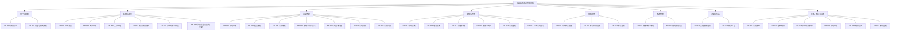

# 系统功能结构图

本图按当前 FR-001～FR-034 归纳系统功能，不代表页面结构或代码模块设计。

```mermaid
flowchart TB
    SYS[校园社团活动管理系统]
    SYS --> IAM[用户与权限]
    SYS --> CLUB[社团与成员]
    SYS --> ACT[活动管理]
    SYS --> REG[报名与签到]
    SYS --> COLLAB[筹备协作]
    SYS --> RES[资源管理]
    SYS --> MSG[通知与待办]
    SYS --> GOV[反馈、统计与治理]

    IAM --> FR001[FR-001 身份认证]
    IAM --> FR002[FR-002 角色与归属授权]
    CLUB --> FR003[FR-003 社团浏览]
    CLUB --> FR004[FR-004 入社申请]
    CLUB --> FR005[FR-005 入社处理]
    CLUB --> FR032[FR-032 成员身份维护]
    CLUB --> FR033[FR-033 社团备案与审核]
    CLUB --> FR034[FR-034 社团状态及负责人变更]
    ACT --> FR006[FR-006 活动草稿]
    ACT --> FR007[FR-007 提交审核]
    ACT --> FR008[FR-008 活动审核]
    ACT --> FR009[FR-009 发布与开启报名]
    ACT --> FR010[FR-010 浏览与筛选]
    ACT --> FR011[FR-011 活动详情]
    ACT --> FR022[FR-022 活动日历]
    REG --> FR012[FR-012 活动报名]
    REG --> FR013[FR-013 取消报名]
    REG --> FR014[FR-014 容量控制]
    REG --> FR015[FR-015 候补与转正]
    REG --> FR016[FR-016 活动签到]
    REG --> FR017[FR-017 个人活动记录]
    COLLAB --> FR018[FR-018 筹备任务创建]
    COLLAB --> FR019[FR-019 任务状态更新]
    COLLAB --> FR023[FR-023 任务看板]
    RES --> FR024[FR-024 场地申请与审核]
    RES --> FR027[FR-027 物资申请记录]
    MSG --> FR020[FR-020 关键事件通知]
    MSG --> FR021[FR-021 待办汇总]
    GOV --> FR025[FR-025 活动评价]
    GOV --> FR026[FR-026 基础统计]
    GOV --> FR028[FR-028 简单活动推荐]
    GOV --> FR029[FR-029 活动举报]
    GOV --> FR030[FR-030 统计导出]
    GOV --> FR031[FR-031 审计查看]
```

Must 构成当前课程版本的最低闭环；Should 和 Could 的实施仍需结合课程时间与评审结论决定。
