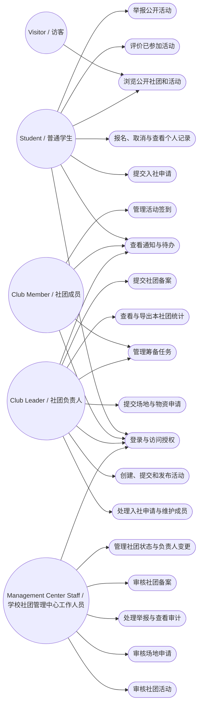

# 系统用例模型

系统具有三个业务层次：学校社团管理中心、各学生社团和普通学生。Visitor / 访客只作为浏览公开信息的辅助 Actor，不构成独立业务层级。Club Member / 社团成员和 Club Leader / 社团负责人本质上仍属于学生用户，但在具体社团上下文中拥有附加角色和权限。Management Center Staff / 学校社团管理中心工作人员是学校层面的业务管理角色，不表示服务器、数据库或运维权限。

所有受保护用例同时受 Role Permission 与 Resource Ownership 约束：普通学生只能管理本人的业务记录；社团成员和负责人只能操作所属或负责社团范围内的资源；管理中心工作人员按职责执行跨社团审核、治理、资源审批、统计与审计。

用例与需求对应关系：UC1 对应 FR-003、FR-010、FR-011、FR-022、FR-028；UC2 对应 FR-001～FR-002；UC3 对应 FR-004；UC4 对应 FR-012～FR-015、FR-017；UC5 对应 FR-025；UC6 对应 FR-005、FR-032；UC7 对应 FR-006～FR-007、FR-009；UC8 对应 FR-008；UC9 对应 FR-018～FR-019、FR-023；UC10 对应 FR-024 的申请职责和 FR-027；UC11 对应 FR-020～FR-021；UC12 对应 FR-026、FR-030；UC13 对应 FR-029 的提交职责；UC14 对应 FR-016；UC15 对应 FR-024 的审核职责；UC16 对应 FR-029 的处理职责和 FR-031；UC17～UC18 分别对应 FR-033 的提交与审核职责；UC19 对应 FR-034。